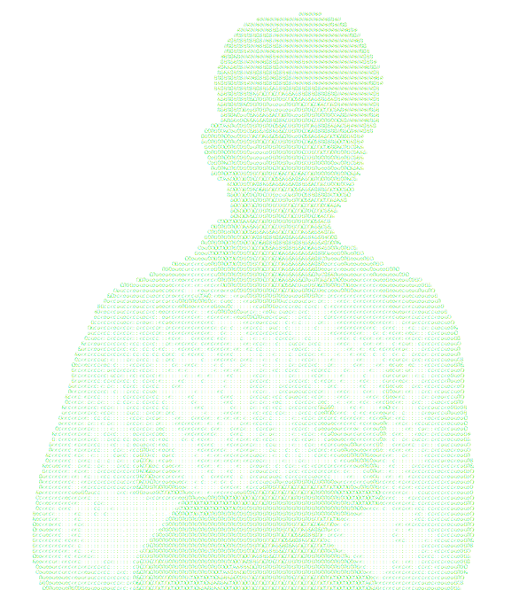

<table>
<tr>
<td width="380" valign="top">

</td>
<td valign="top">

### about
Chemical Engineering undergrad at MNIT Jaipur, self-taught in software engineering.
Interested in systems programming, full-stack web, and ML-adjacent tooling. Active in competitive
programming (LeetCode, Codeforces) and campus tech leadership (C2C, CS Club, Sphinx).

**[Portfolio](https://ronaksharma.vercel.app/)**

</td>
</tr>
</table>

---

### selected projects

| Project | Stack | What it does |
|---|---|---|
| **[SwiftRoute](https://github.com/Ronakkkkkkk/SwiftRoute)** | C++17 / Docker / Leaflet.js | Real-time delivery routing & dispatch engine (Dijkstra, REST API) · [live](https://swift-route-mu.vercel.app/) |
| **[The Vault](https://github.com/Ronakkkkkkk/movie-recommendation-system)** | FastAPI / Streamlit / scikit-learn | Movie recommendation engine (TF-IDF + cosine similarity) · [live](https://the-vault.streamlit.app/) |
| **[TraceLens](https://github.com/Ronakkkkkkk/trace-lens)** | Node.js / React / D3.js / WebSocket | Real-time distributed tracing system — live service graph + span waterfall · [live](https://trace-lens-mu.vercel.app) |
| **[DataBrief](https://github.com/Ronakkkkkkk/multi-agent-ai)** | LangChain / Groq / Streamlit | Multi-agent AI research assistant — searches, reads, writes, and critiques reports · [live](https://databrief.streamlit.app/) |
| **[LRU Cache](https://github.com/Ronakkkkkkk/lru-cache)** | C++17 | Thread-safe, custom-implemented LRU cache |

---

### contribution snake

